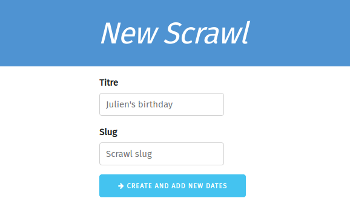

# Scrawly
Doodle like

## Etapes
1. Créer la base de données (MySQL Workbench)
2. Créer le projet Symfony avec API Platform
3. Créer les entités Doctrine
4. Créer le projet ReactJS
5. Installer react-router
6. Créer les différents composants et la navigation entre les pages
7. Installer Redux (optionnel)
8. Développer les différentes pages / composants

## Aides
Vous aurez besoin de rechercher un Scrawl par son slug à plusieurs endroit dans l'application.
API Platform ne permettant par défaut des recherches uniquement par ID, vous devrez utiliser un [filtre de recherche](https://api-platform.com/docs/core/filters/#search-filter) pour pouvoir requêter l'API.

## Pages
Le site internet ayant pour objectif d'être simple d'utilisation et ne contenant pas d'informations confidentielles, il ne sera pas nécessaire de créer un compte pour pouvoir créer ou participer à un Scrawl.

### Accueil
La page d'accueil affichera un formulaire permettant d'afficher un Scrawl par son ID.
Si le Scrawl n'existe pas, l'utiliser est alors notifié par un message.
S'il existe, il est redirigé vers le Scrawl correspondant.

Un bouton permettra également de créer un nouveau Scrawl.

### Création d'un Scrawl
Lorsque l'utilisateur créé un scrawl, il commence par saisir son titre.
Lors de la saisie, un slug est alors généré en temps réel.
Au moment de la validation, une vérification est effectuée pour vérifier si le slug est déjà existant.
Si c'est le cas, le Scrawl n'est pas créer et l'utilisateur peut alors saisir un autre slug.

Ensuite, l'utilisateur peut ajouter une série de dates.
Le nom du Scrawl est affiché sur la page mais ne peut pas être modifié.
Lorsque l'utilisateur clique sur le bouton "Finish", il est alors redirigé vers la page du Scrawl créé.

### Affichage d'un Scrawl
Sur la page d'un Scrawl, les internautes pourront voir la liste des dates proposées ainsi que la liste des participants.

Les utilisateurs pourront ajouter ou modifier leur participation. Cette fonctionnalité ne nécessitant pas de créer un compte, il sera possible de modifier les participations des autres personnes.

L'avatar de l'utilisateur sera récupérer grace au service [Gravatar](https://en.gravatar.com/site/implement/images/).

